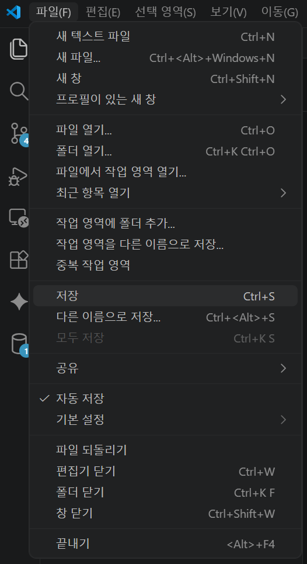

# 02. VS Code 설치 및 설정

## 1. 목적

Git 실습과 데이터 분석 작업에 사용할 VS Code를 설치하고 기본 설정을 완료합니다.

---

## 2. 다운로드 링크

아래 링크에서 Windows 사용자용 VS Code 설치 파일을 다운로드합니다.

```text
https://code.visualstudio.com/thank-you?dv=win64user
```

---

## 3. 설치 절차

1. 위 다운로드 링크에 접속합니다.
2. Windows용 설치 파일을 다운로드합니다.
3. 설치 파일을 실행합니다.
4. 기본 옵션으로 설치합니다.
5. VS Code를 실행합니다.

---

## 4. 권장 확장 프로그램

데이터 분석 실습에서는 아래 확장 프로그램을 우선 설치합니다.

| 구분 | 확장 프로그램                        | 사용 목적                                    |
| ---- | ------------------------------------ | -------------------------------------------- |
| 필수 | Python                               | Python 파일 실행, 가상환경 선택, 디버깅      |
| 필수 | Pylance                              | Python 코드 자동완성, 타입 힌트, 오류 표시   |
| 필수 | Jupyter                              | `.ipynb` 노트북 실행, 셀 단위 분석           |
| 필수 | Korean Language Pack                 | VS Code 메뉴와 안내 메시지 한글 표시         |
| 필수 | GitHub Pull Requests                 | Source Control에서 GitHub Pull Request 확인  |
| 추천 | Rainbow CSV                          | CSV 파일 컬럼 색상 구분, 데이터 확인         |
| 추천 | SQLTools                             | DB 연결, SQL 실행, 쿼리 결과 확인            |
| 추천 | SQLTools MySQL/MariaDB Driver        | MySQL 또는 MariaDB 연결                      |
| 추천 | SQLTools PostgreSQL/Cockroach Driver | PostgreSQL 연결                              |
| 추천 | SQLTools Oracle Driver               | Oracle DB 연결                               |
| 추천 | Markdown Preview Enhanced            | Markdown 문서 미리보기                       |
| 추천 | Prettier                             | Markdown, JSON, JavaScript 등 파일 포맷 정리 |
| 선택 | Material Icon Theme                  | 파일 종류별 아이콘 표시                      |
| 선택 | YAML                                 | `.yml`, `.yaml` 설정 파일 문법 확인          |
| 선택 | PDF                                  | VS Code에서 PDF 파일 바로 확인               |

---

## 5. 자동 저장 설정

파일 수정 후 매번 `Ctrl + S`를 누르지 않도록 자동 저장을 설정합니다.

1. VS Code 상단 메뉴에서 File 선택
2. Auto Save 선택
3. Auto Save에 체크 표시가 되었는지 확인



설정 메뉴에서 직접 변경할 수도 있습니다.

| 설정 항목              | 권장 값    | 설명                                 |
| ---------------------- | ---------- | ------------------------------------ |
| Files: Auto Save       | afterDelay | 수정 후 일정 시간이 지나면 자동 저장 |
| Files: Auto Save Delay | 1000       | 수정 후 1초 뒤 자동 저장             |

---

## 6. 완료 기준

아래 작업이 가능하면 다음 단계로 이동합니다.

- VS Code 실행
- 필수 확장 프로그램 설치
- 자동 저장 설정
