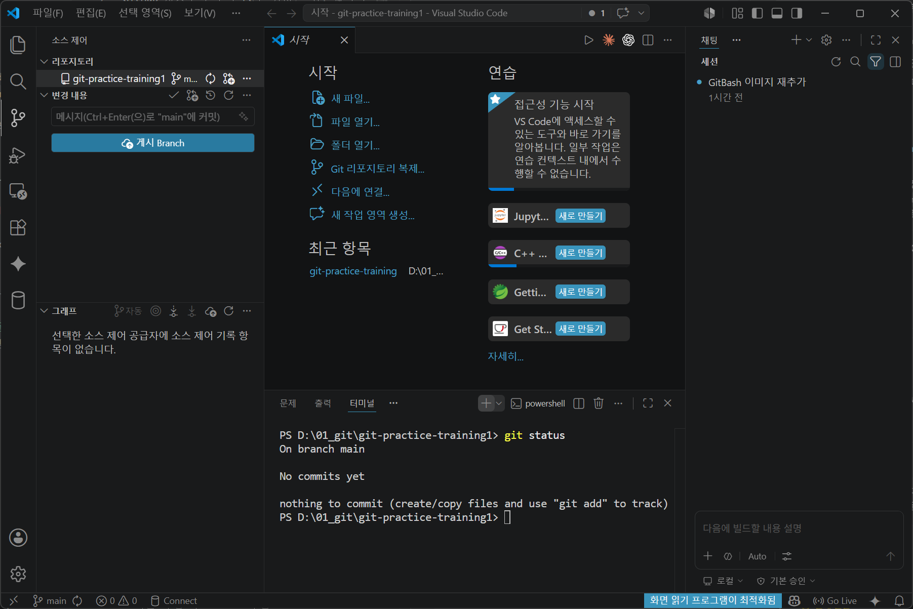
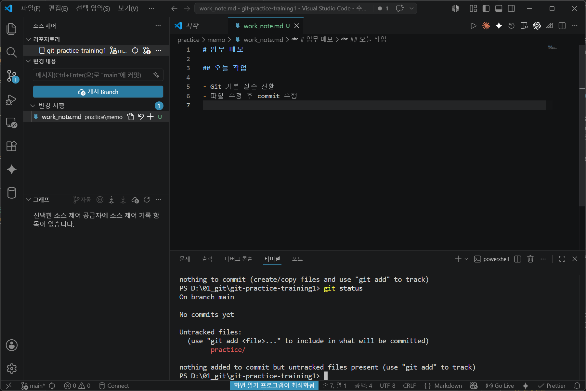
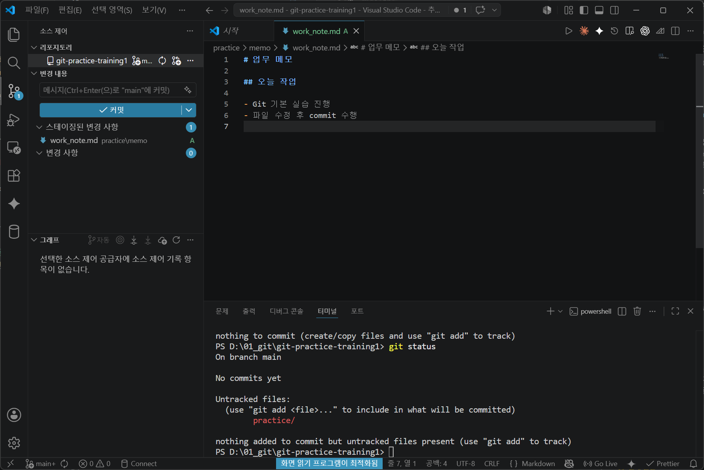
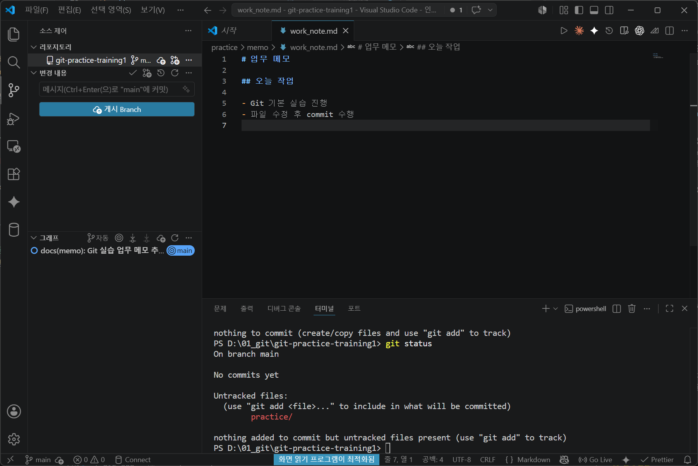
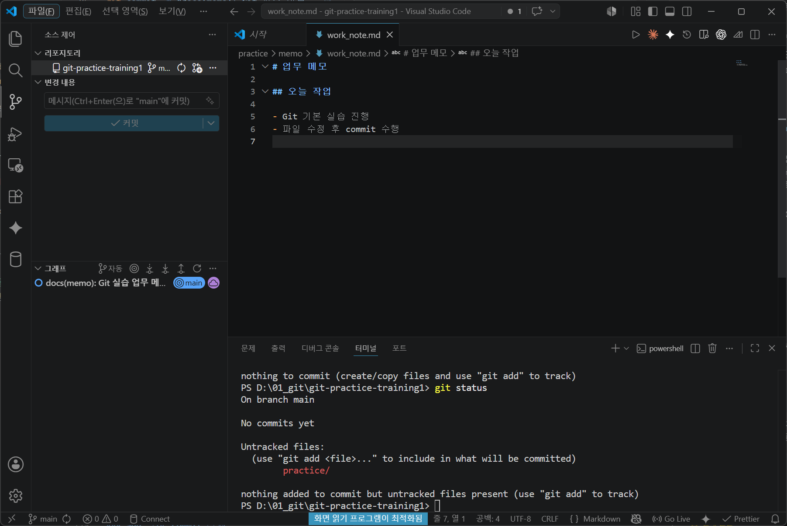
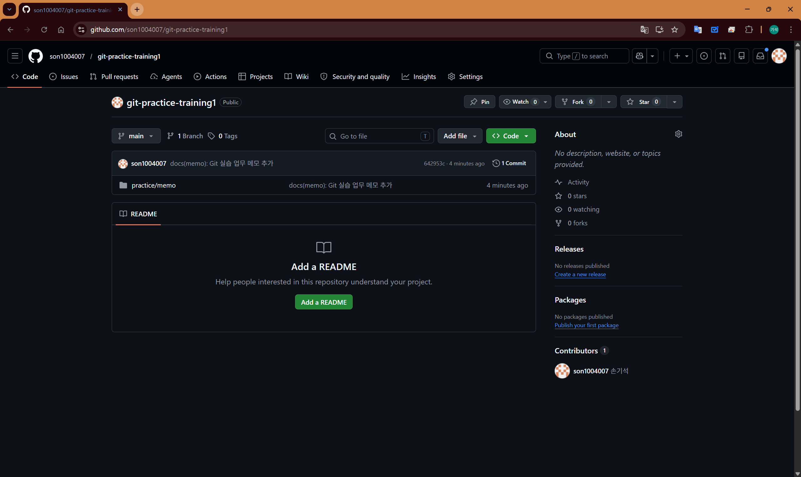

# 04. clone, commit, push 실습

## 1. 목적

GitHub 저장소를 로컬 PC로 가져온 뒤, 파일을 수정하고 GitHub에 반영하는 기본 흐름을 실습합니다.

---

## 2. 기본 흐름

```text
clone → 파일 수정 → status 확인 → add → commit → push → GitHub 확인
```

---

## 4. 현재 상태 확인

```bash
git status
```



아직 수정한 파일이 없다면 변경사항이 없다고 표시됩니다.

---

## 5. 파일 수정

아래 파일을 수정합니다.

```text
practice/memo/work_note.md
```

예시 내용:

```markdown
# 업무 메모

## 오늘 작업

- Git 기본 실습 진행
- 파일 수정 후 commit 수행
```

---

## 6. 변경사항 확인

```bash
git status
```


수정된 파일이 표시되는지 확인합니다.

---

## 7. stage 처리

수정한 파일을 commit 대상에 포함합니다.

```bash
git add practice/memo/work_note.md
```


전체 변경 파일을 stage하려면 아래 명령어를 사용할 수 있습니다.

```bash
git add .
```

초급 단계에서는 실수 방지를 위해 파일명을 지정하는 방식을 권장합니다.

---

## 8. commit 작성

사내 작성규칙에 맞춰 commit message를 작성합니다.

```bash
git commit -m "docs(memo): Git 실습 업무 메모 추가"
```


---

## 9. GitHub로 push

```bash
git push origin main
```




---

## 10. GitHub에서 확인

GitHub 저장소 화면에서 수정한 파일과 commit 이력이 반영되었는지 확인합니다.

---

## 12. 자주 하는 실수

### add 없이 commit 실행

원인:

commit 대상에 파일을 포함하지 않았습니다.

대응:

```bash
git add 파일명
git commit -m "docs(memo): 업무 메모 수정"
```

### push 후 GitHub에 파일이 보이지 않음

확인할 것:

- push한 branch가 맞는지 확인
- commit이 정상 생성되었는지 확인
- GitHub 화면을 새로고침

---

## 13. 완료 기준

아래 commit message가 GitHub commit history에 표시되면 완료입니다.

```text
docs(memo): Git 실습 업무 메모 추가
```
