# 05. Branch와 Pull Request 실습

## 1. 목적

실무에서는 `main` 브랜치에 직접 작업하지 않고, 작업 단위별 브랜치를 만들어 변경사항을 관리합니다.

이 문서는 branch 생성, 작업, push, Pull Request 생성 흐름을 실습합니다.

---

## 2. 기본 흐름

```text
main 최신화 → branch 생성 → 파일 수정 → commit → push → Pull Request 생성 → merge
```

---

## 3. main 브랜치 최신화

작업 전에는 항상 main 브랜치를 최신 상태로 맞춥니다.

```bash
git switch main
git pull origin main
```

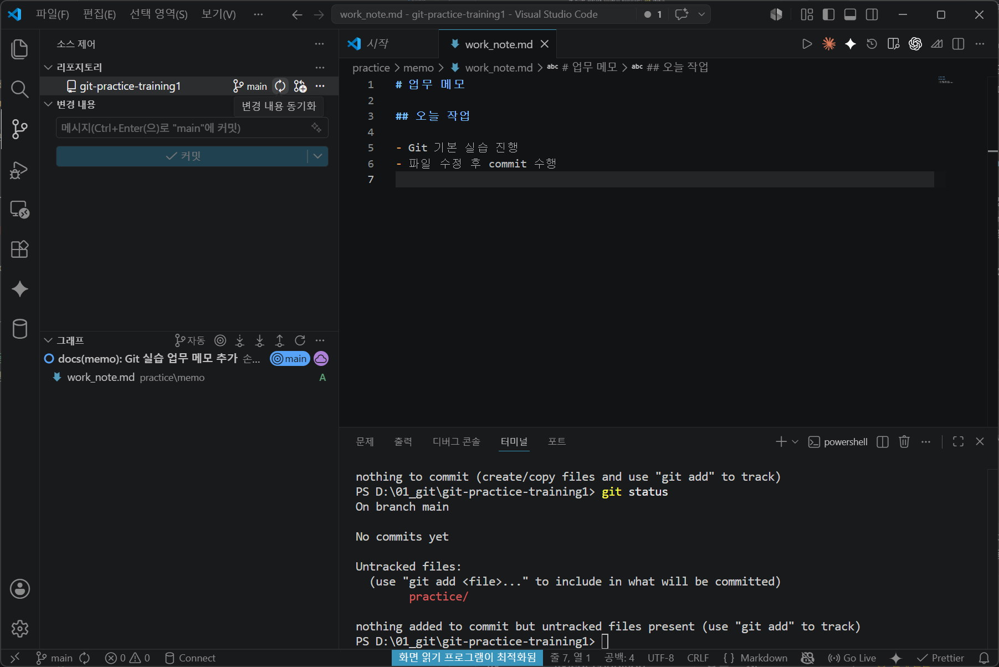

## 4. 작업 브랜치 생성

문서 작업 예시:

```bash
git switch -c docs/update-work-note
```

SQL 작업 예시:

```bash
git switch -c feat/add-analysis-report
```

오류 수정 예시:

```bash
git switch -c fix/report-calculation
```

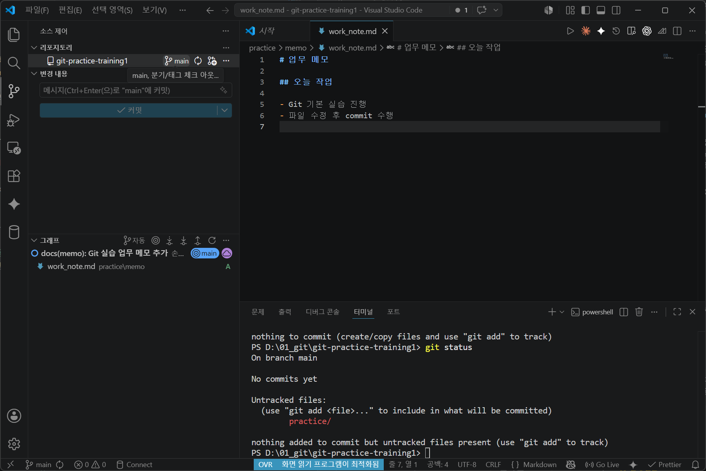
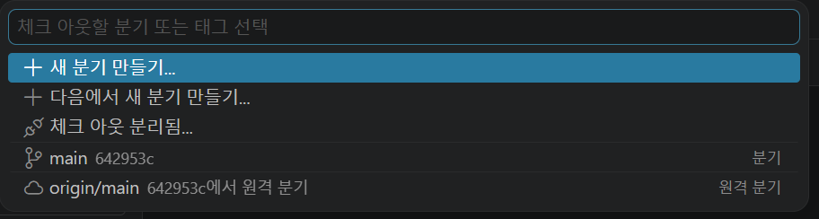
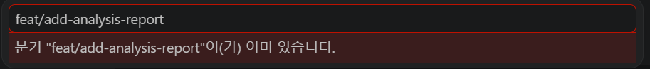

---

## 5. 브랜치 이름 작성 기준

| 구분     | 예시                     | 사용 상황            |
| -------- | ------------------------ | -------------------- |
| docs     | docs/update-readme       | 문서 수정            |
| feat     | feat/add-analysis-report | 새 분석 결과물 추가  |
| fix      | fix/sql-condition        | 오류 수정            |
| chore    | chore/cleanup-files      | 폴더 정리, 설정 정리 |
| refactor | refactor/preprocess-code | 구조 개선            |

---

## 6. 파일 수정 후 commit

예시 파일:

```text
practice/report/analysis_result.md
```

commit 예시:

```bash
git add practice/report/analysis_result.md
git commit -m "docs(report): 분석 결과 요약 추가"
```

---

## 7. 원격 브랜치로 push

```bash
git push origin docs/update-work-note
```

처음 push하는 브랜치는 GitHub에 새 브랜치로 생성됩니다.
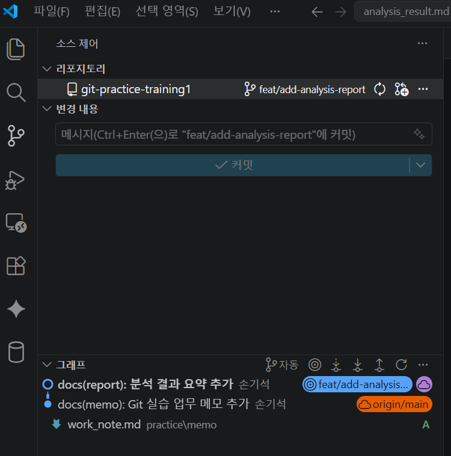

---

## 8. Pull Request 생성

GitHub 저장소 화면에서 아래 순서로 진행합니다.

1. Compare & pull request 선택
2. 제목 작성
3. 변경 내용 요약 작성
4. Create pull request 선택
5. 변경 파일 확인
6. 문제가 없으면 merge

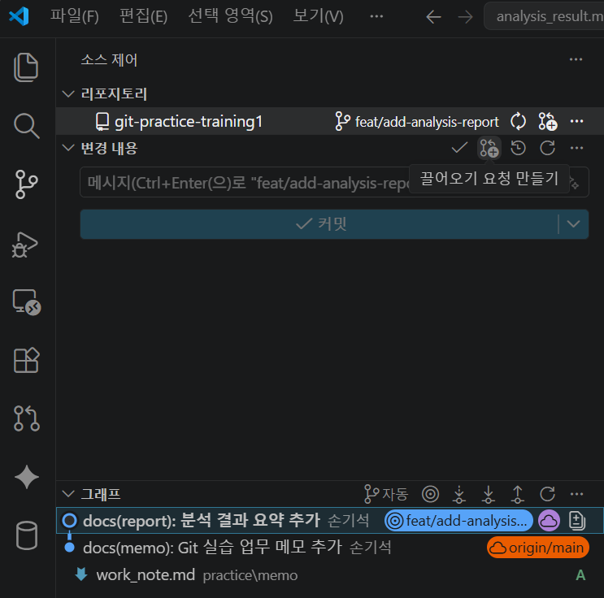

## 9. Pull Request 제목 예시

```text
docs(report): 분석 결과 요약 추가
feat(sql): 사용자 접속 통계 쿼리 추가
fix(report): 지표 설명 오류 수정
```

commit message와 유사하게 작성하면 이력 관리가 쉽습니다.
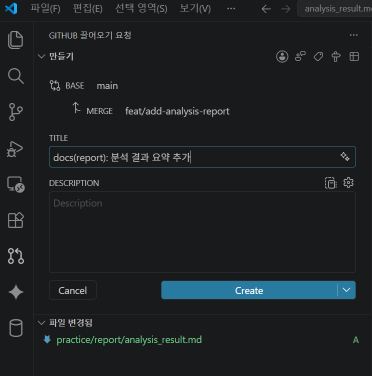

---

## 10. Pull Request 본문 예시

```markdown
## 변경 내용

- 분석 결과 요약 문서 추가
- 지표 설명 보완

## 확인 사항

- [ ] 오탈자 확인
- [ ] 파일 경로 확인
- [ ] commit message 규칙 확인
```

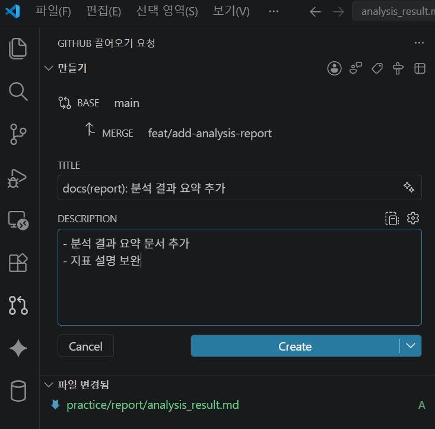

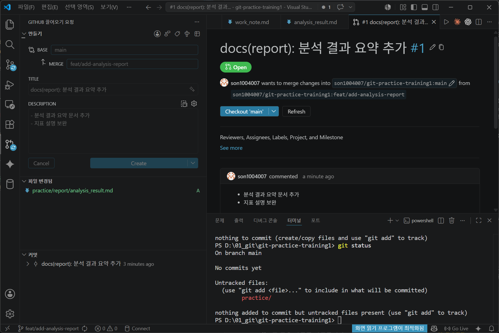

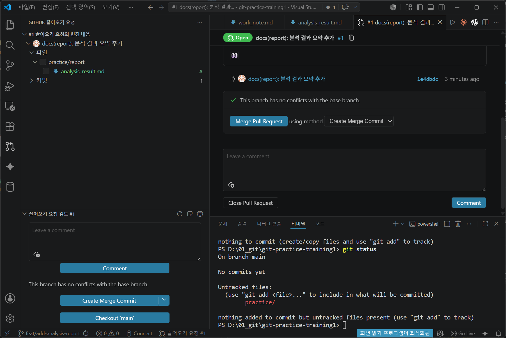

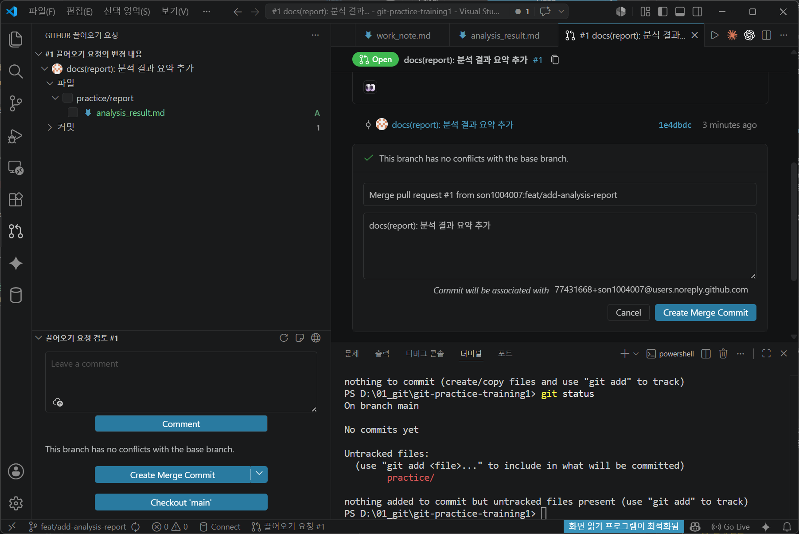

---

## 11. merge 후 로컬 main 최신화

PR이 merge되면 로컬 main도 최신화합니다.

```bash
git switch main
git pull origin main
```

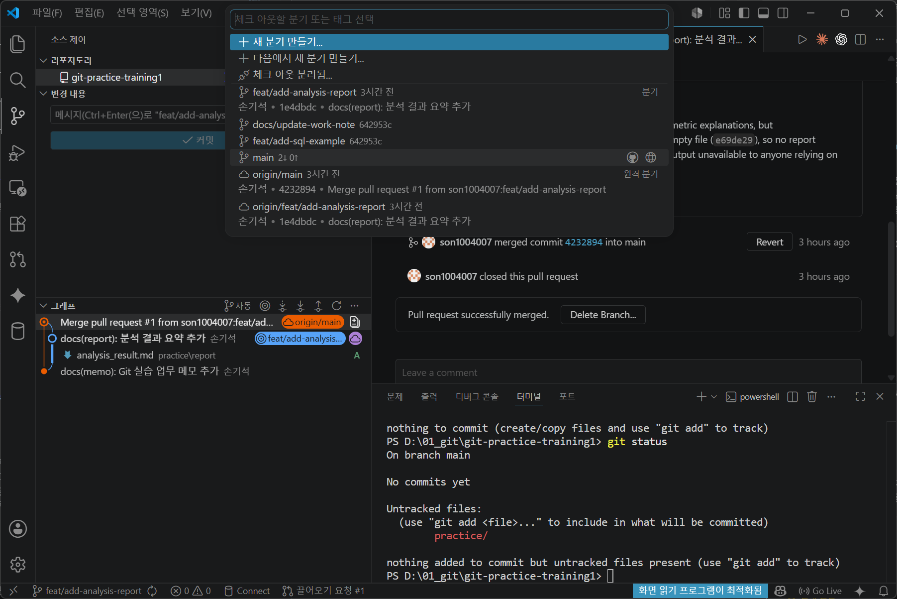

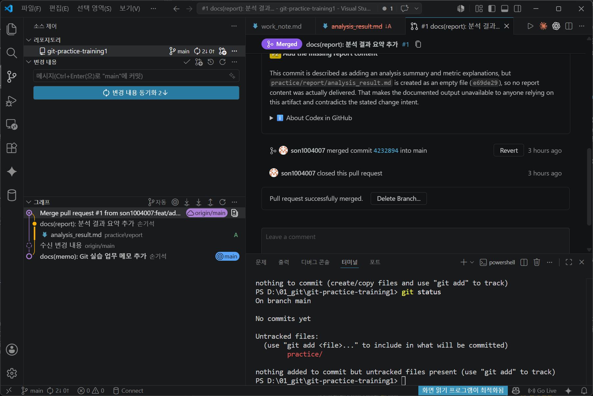

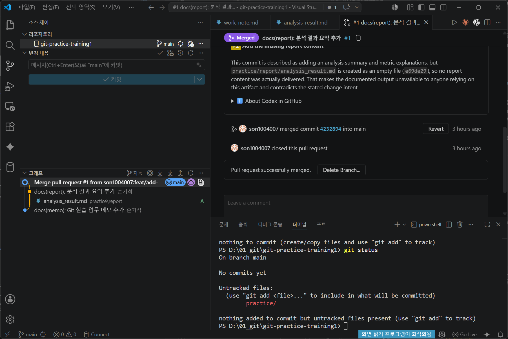
작업이 끝난 브랜치는 삭제할 수 있습니다.

```bash
git branch -d docs/update-work-note
```

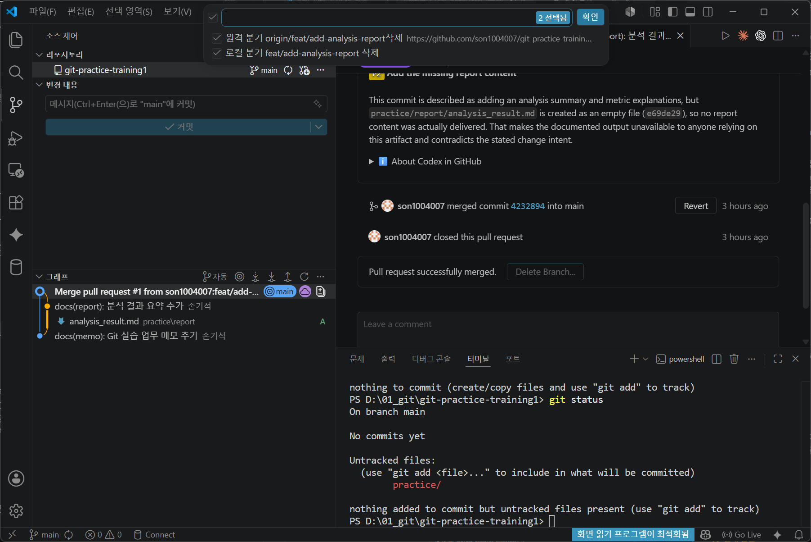
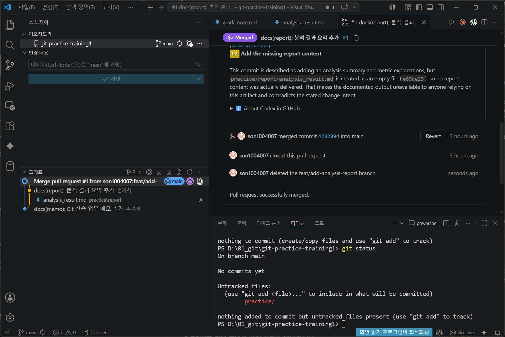

## 12. 실무 기준

- main 직접 작업은 최소화합니다.
- 작업 단위별 브랜치를 생성합니다.
- PR에는 변경 목적과 확인 사항을 작성합니다.
- merge 전 변경 파일을 확인합니다.
- 작업이 끝난 브랜치는 정리합니다.

---
