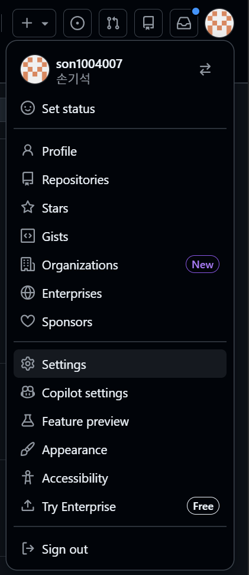
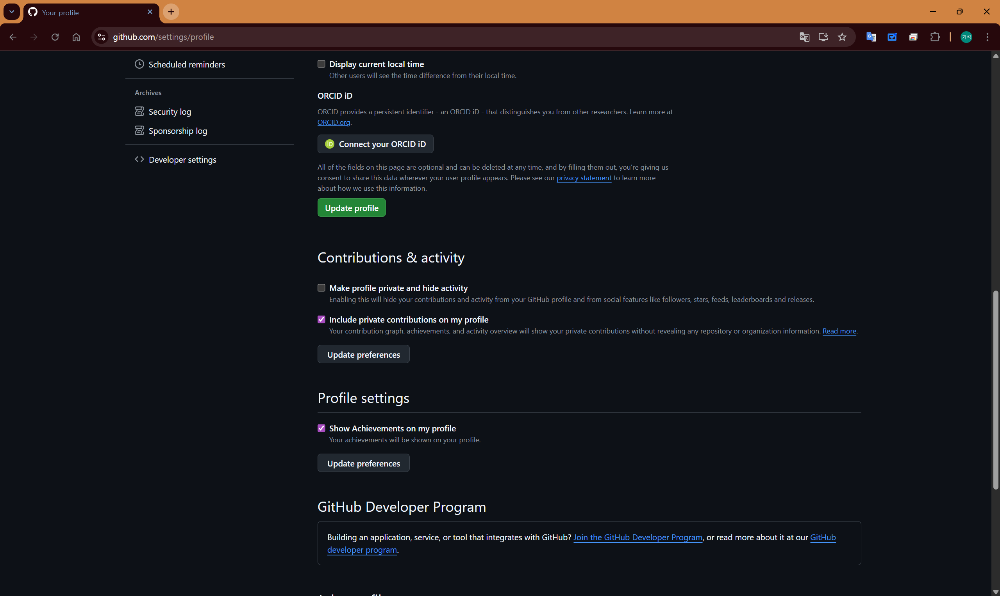
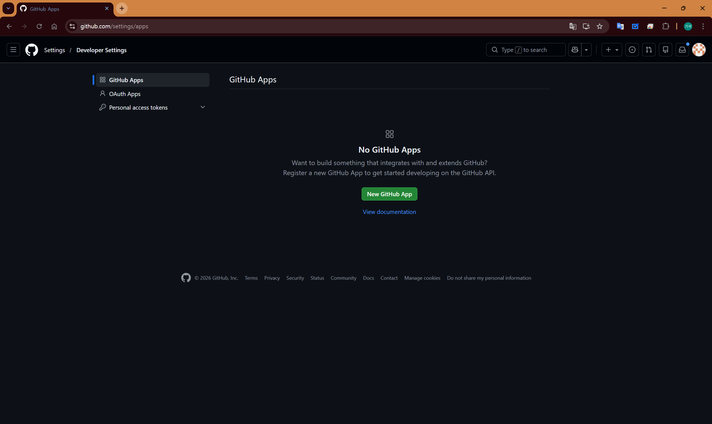
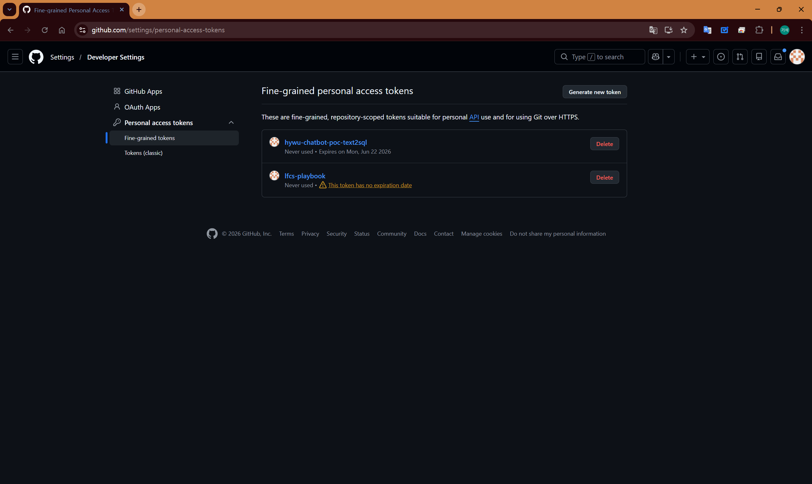
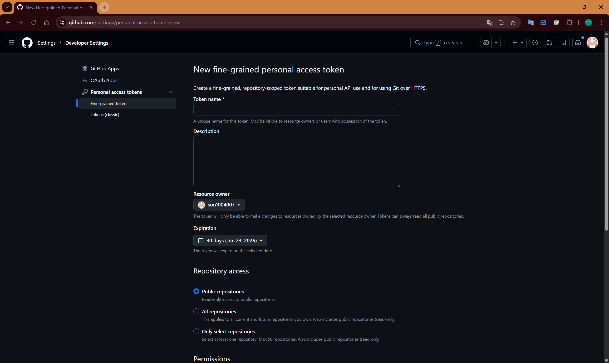
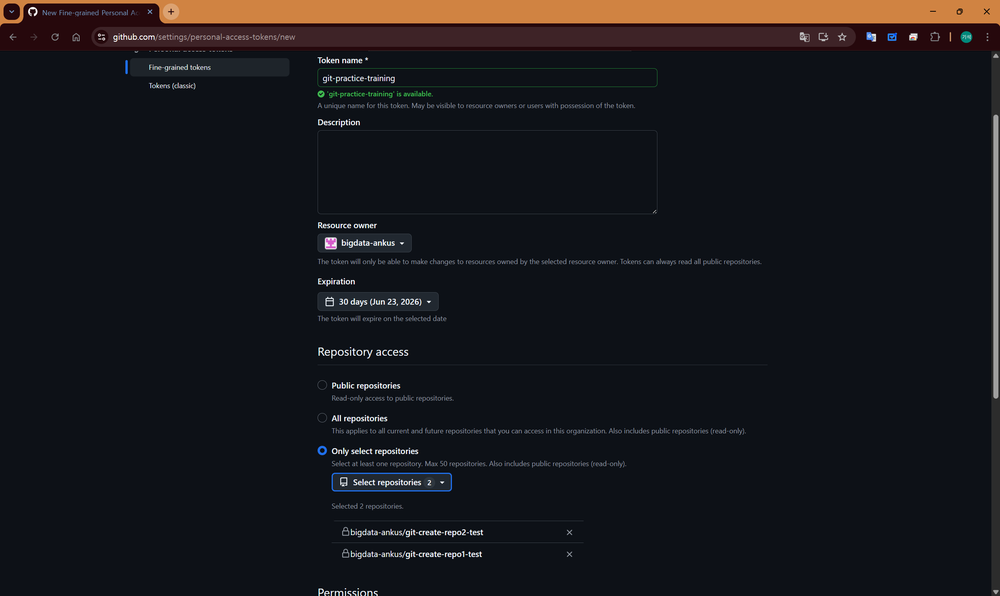
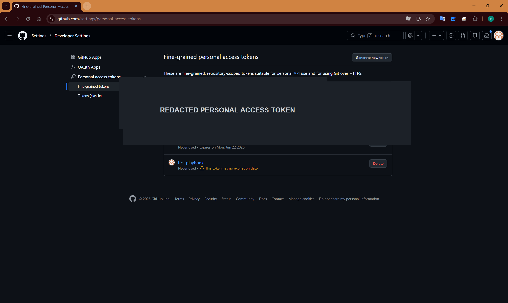

# 17. PAT 생성 방법

## 1. 목적

GitHub 저장소를 HTTPS 방식으로 clone, push 할 때 인증이 필요한 경우 PAT를 사용합니다.

PAT는 GitHub 비밀번호를 대신해 Git 작업 인증에 사용하는 개인 인증 값입니다.

---

## 2. 언제 필요한가

아래 상황에서 필요할 수 있습니다.

| 상황                            | 설명                             |
| ------------------------------- | -------------------------------- |
| clone 시 인증 요구              | Private 저장소 접근 시 인증 필요 |
| push 시 인증 실패               | 저장소 쓰기 권한 확인 필요       |
| Git Bash에서 비밀번호 입력 요청 | 비밀번호 대신 PAT 입력 필요      |
| 회사 PC에서 인증 정보 초기화    | 다시 인증 정보 입력 필요         |

---

## 3. 권장 방식

GitHub는 가능하면 `Fine-grained personal access token` 사용을 권장합니다.

교육 실습에서는 필요한 저장소에만 접근 권한을 부여하고, 만료일을 설정하는 방식이 적절합니다.

---

## 4. 생성 절차

1. GitHub에 로그인합니다.
2. 우측 상단 프로필 이미지를 선택합니다.
3. `Settings`를 선택합니다.
   
4. 왼쪽 메뉴에서 `Developer settings`를 선택합니다.
   
5. `Personal access tokens`를 선택합니다.
   
6. `Fine-grained tokens`를 선택합니다.
   
7. `Generate new token`을 선택합니다.

8. 이름을 입력합니다.
   
9. 만료일을 설정합니다.
10. 접근할 계정 또는 조직을 선택합니다.
11. 접근할 저장소를 선택합니다.
12. 필요한 권한만 선택합니다.
13. 생성 버튼을 선택합니다.
14. 생성된 값을 안전한 곳에 보관합니다.
    
    

## 5. 사용 방법

Git Bash에서 HTTPS 저장소를 clone 또는 push 할 때 인증을 요구하면 아래처럼 입력합니다.

| 입력 항목 | 입력값                       |
| --------- | ---------------------------- |
| Username  | GitHub 사용자명              |
| Password  | GitHub 비밀번호가 아니라 PAT |

---

## 6. 주의사항

- PAT는 비밀번호처럼 취급합니다.
- 문서, Slack, 메일, GitHub commit에 노출하지 않습니다.
- 실습이 끝나면 삭제하거나 만료되도록 설정합니다.
- 권한은 필요한 저장소와 필요한 권한만 부여합니다.
- 장기간 사용하는 값은 만들지 않습니다.

---

## 7. 삭제 방법

실습이 끝났거나 더 이상 필요하지 않으면 삭제합니다.

1. GitHub `Settings`로 이동합니다.
2. `Developer settings`로 이동합니다.
3. `Personal access tokens`로 이동합니다.
4. 생성한 항목을 선택합니다.
5. 삭제합니다.

---

## 9. 완료 기준

| 확인 항목                  | 완료 |
| -------------------------- | ---- |
| PAT 생성 완료              |      |
| 실습 저장소 권한 설정 완료 |      |
| clone 또는 push 인증 성공  |      |
| 만료일 설정 완료           |      |

---

## 10. 다음 단계

PAT 생성 후 아래 문서로 이동합니다.

- [04. clone, commit, push 실습](./04_clone_commit_push_실습.md)
- [08. 자주 발생하는 문제](./08_자주_발생하는_문제.md)

---

## 11. 참고

GitHub 공식 문서에서는 PAT를 명령줄 또는 API 인증 시 비밀번호 대신 사용할 수 있다고 설명합니다. 또한 가능하면 fine-grained PAT 사용을 권장합니다.
